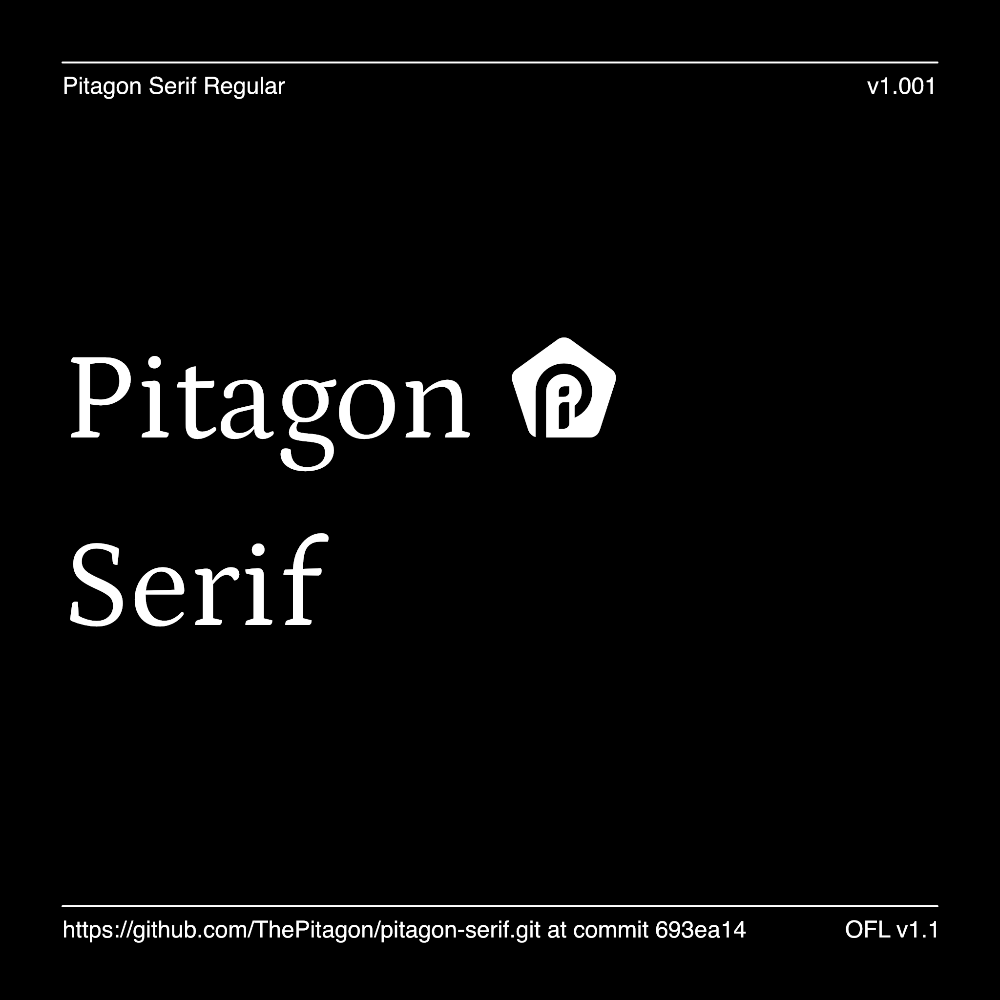

# Pitagon Serif

[![][Fontbakery]](https://ThePitagon.github.io/pitagon-serif/fontbakery/fontbakery-report.html)
[![][Universal]](https://ThePitagon.github.io/pitagon-serif/fontbakery/fontbakery-report.html)
[![][GF Profile]](https://ThePitagon.github.io/pitagon-serif/fontbakery/fontbakery-report.html)
[![][Outline Correctness]](https://ThePitagon.github.io/pitagon-serif/fontbakery/fontbakery-report.html)
[![][Shaping]](https://ThePitagon.github.io/pitagon-serif/fontbakery/fontbakery-report.html)

[Fontbakery]: https://img.shields.io/endpoint?url=https%3A%2F%2Fraw.githubusercontent.com%2FThePitagon%2Fpitagon-serif%2Fgh-pages%2Fbadges%2Foverall.json

[GF Profile]: https://img.shields.io/endpoint?url=https%3A%2F%2Fraw.githubusercontent.com%2FThePitagon%2Fpitagon-serif%2Fgh-pages%2Fbadges%2FGoogleFonts.json

[Outline Correctness]: https://img.shields.io/endpoint?url=https%3A%2F%2Fraw.githubusercontent.com%2FThePitagon%2Fpitagon-serif%2Fgh-pages%2Fbadges%2FOutlineCorrectnessChecks.json

[Shaping]: https://img.shields.io/endpoint?url=https%3A%2F%2Fraw.githubusercontent.com%2FThePitagon%2Fpitagon-serif%2Fgh-pages%2Fbadges%2FShapingChecks.json

[Universal]: https://img.shields.io/endpoint?url=https%3A%2F%2Fraw.githubusercontent.com%2FThePitagon%2Fpitagon-serif%2Fgh-pages%2Fbadges%2FUniversal.json

Pitagon Serif is a part of the Pitagon font set, which be used in Pi Design System.

## About

Pitagon Serif is a fresh take on geometric serif styles, contains the Pitagon Design Principles embodied in the
Pitagon Design System (Pi Design System). Pitagon Serif is implemented and inspired by open source font sets like as
IBM Plex Serif and Source Serif. The font set is used in the context of specific use of text such as articles,
books, magazine, etc.

Taking inspiration in Source Serif, the font have heavy asymmetric serifs and arms with inverted angles, which
combine with lowercase designs that share a big x-height, pronounced ascenders, and soft curves of low stroke
contrast, without losing the essence of a design intended for legibility in digital and print media, from headlines
to body text. It blends styles of many great typefaces and is suitable for any design medium. The font set also
conveys well the brand message of Pitagon is "<b><i>BREAKTHROUGH</i></b> the limits".

The font set are made available for public use under the SIL Open Font License.

To contribute, visit <a href="https://github.com/ThePitagon/pitagon-serif" target="_blank">Pitagon Serif's
GitHub repository</a>.

## Building

Fonts are built automatically by GitHub Actions - take a look in the "Actions" tab for the latest build.

If you want to build fonts manually on your own computer:

* `make build` will produce font files.
* `make test` will run [FontBakery](https://github.com/googlefonts/fontbakery)'s quality assurance tests.
* `make proof` will generate HTML proof files.

The proof files and QA tests are also available automatically via GitHub Actions - look
at https://ThePitagon.github.io/pitagon-serif

## Changelog

### v1.0.1

Release date: 08 March 2023

- First public released.
- Open sourced.
- Add icon characters.

## Download

[Click here to get the latest release](https://github.com/ThePitagon/pitagon-serif/releases/latest)

After downloading the zip from above:

- Double-click the downloaded zip file to unpack or open it.
- Mac OSX: Use FontBook Software (Default App on Mac). Select the fonts files you want to install and drag the fonts
  into your library, or you can find Macintosh HD/Library/Fonts and copy the font files to the directory.
- Windows: Select all fonts you want to install and pop-up of the fonts file will show, click install and done. Or Go to
  Start > Control Panel > Fonts, then locate fonts file and click install.

## License

This Font Software is licensed under the SIL Open Font License, Version 1.1. This license is available with a FAQ at
https://scripts.sil.org/OFL
